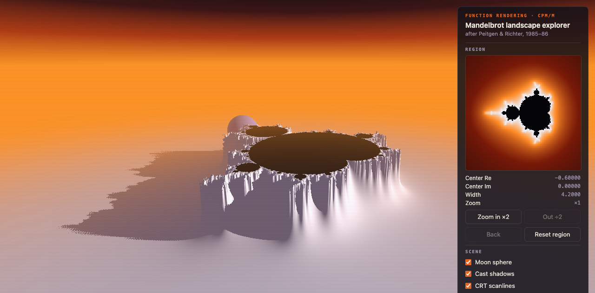
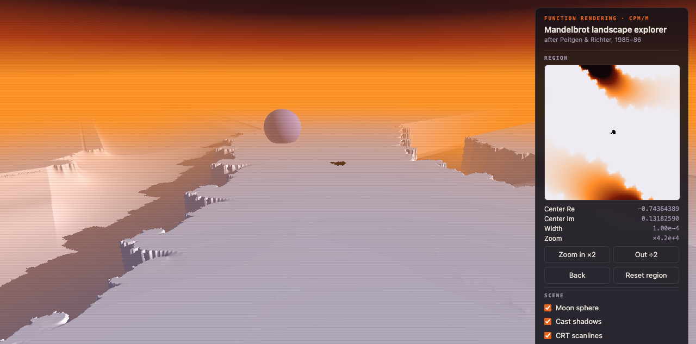

# Mandelbrot Landscape Explorer

A real-time, self-hosted recreation of the classic **Peitgen–Richter "potential
landscape"** rendering of the Mandelbrot set — the style of the August-1985
*Scientific American* cover and the plates in *The Beauty of Fractals*
(Springer, 1986) — extended into an interactive explorer that lets you dive
into the set itself.



The terrain is not modeled geometry: it is the graph of a single mathematical
function — the Douady–Hubbard potential of the Mandelbrot set's exterior —
rendered as a height field. The set itself appears as the flat black "lake" on
top of the mesa; the needle spikes along the cliffs are the set's external
filaments, one grid cell wide.

## Features

- **Classic 1985/86 look** — inverted-potential terrain, low warm sun with
  violet shadow pools, black interior lake, sunset-gradient sky, horizon fog,
  decorative "moon" sphere, optional CRT scanlines.
- **Full camera freedom** — drag to orbit, wheel/pinch to dolly, right-drag to
  pan; the camera never sinks below the terrain.
- **Dive into the set** — double-click any terrain point to zoom ×2 into the
  Mandelbrot set at that location, or drive the Region panel (clickable
  minimap, Zoom ×2 / ÷2, dive-history Back, Reset). Verified to ×84,000, where
  mini-Mandelbrots resolve as their own lakes; hard limit ×~4·10¹²
  (IEEE-double resolution).
- **Everything is adjustable live** — sun azimuth/elevation/intensity, cliff
  steepness, sphere on/off + position + altitude, shadows, grid resolution
  (512²–2048²).
- **Self-hosted & dependency-free** — TypeScript + Vite, zero runtime
  dependencies; the build is a fully static site.



## Quick start

Requires Node 20+.

```bash
cd app
npm install
npm run dev        # dev server with HMR → http://localhost:5173
```

## Build & self-host

```bash
cd app
npm run build      # typecheck (tsc --noEmit) + bundle → app/dist/
npm run preview    # sanity-check the production build locally
```

`app/dist/` is plain static files with relative asset paths — deploy it to any
web server (nginx, GitHub Pages, S3, `npx serve dist`). No backend, no CDN, no
external requests.

## Controls

| Input | Effect |
|---|---|
| drag | orbit the camera |
| wheel / pinch | camera zoom (dolly) |
| right-drag / shift-drag | pan the camera target |
| **double-click terrain** | **dive ×2 into the set at that point** |
| Region panel | minimap (click to recenter) · Re/Im/width/zoom readouts · Zoom ×2 / ÷2 · Back · Reset region |
| Scene | moon sphere · cast shadows · CRT scanlines |
| Sphere | position X/Y · altitude above the terrain resting point |
| Light | sun azimuth · elevation · intensity |
| Terrain | cliff steepness (live) · grid resolution |

## How it works

1. **Field stage** (Web Worker): escape-time iteration `z ← z² + c` over the
   current complex window computes the potential `φ(c) ≈ ln|z_n| / 2ⁿ`
   (CPM/M, *The Science of Fractal Images*). It is stored in log space
   (`L = log₂ φ`) because raw φ underflows doubles at deep zoom, then
   normalized per window against its 98th percentile — equivalent to
   auto-retuning the cliff steepness, so every zoom depth renders as the same
   mesa-and-cliffs world. Iteration budget scales with depth (400 → 2500).
2. **Render stage** (WebGL2 fragment shader): per-pixel ray march of the
   height field `h = 0.55 · exp(−β·√φ̂)`, finite-difference normals, Lambert
   shading + cast-shadow march, analytic sphere intersection, and distance fog
   colored exactly like the horizon so far terrain melts into the sunset.

World space is fixed at [−2.1, 2.1]²; the complex window mapped onto it is what
the explorer zooms — camera zoom and set zoom are fully independent.

## Project layout

```
app/                     Self-hosted TypeScript app (canonical) — see app/README.md
web/                     Single-file prototype (same math/UX, no build step)
docs/reference/          Reproduction study, original image, PoC render, screenshots
docs/design/             Project design & feature registry
test_scripts/            Offline Python proof-of-concept (numpy, uv-managed)
```

The reproduction study —
[`docs/reference/investigation-mandelbrot-potential-landscape-rendering.md`](docs/reference/investigation-mandelbrot-potential-landscape-rendering.md)
— documents the image's identification, the mathematics, and the validated
rendering recipe. The offline PoC that validated it:

```bash
cd test_scripts
uv init && uv add numpy pillow      # once
uv run python poc_potential_landscape.py
```

## Credits & references

- H.-O. Peitgen & P. H. Richter, *The Beauty of Fractals*, Springer 1986 —
  origin of the potential-landscape style (with the Bremen group).
- H.-O. Peitgen & D. Saupe (eds.), *The Science of Fractal Images*, Springer
  1988 — the CPM/M algorithm.
- A. Douady & J. H. Hubbard — the potential (Green's function) of the
  Mandelbrot set's complement.
- The reference scan of the original plate is kept **locally only**
  (`docs/reference/original-mandelbrot-potential-landscape.png`, gitignored) —
  it is from the 1985/86 publications and is not redistributed in this
  repository.
